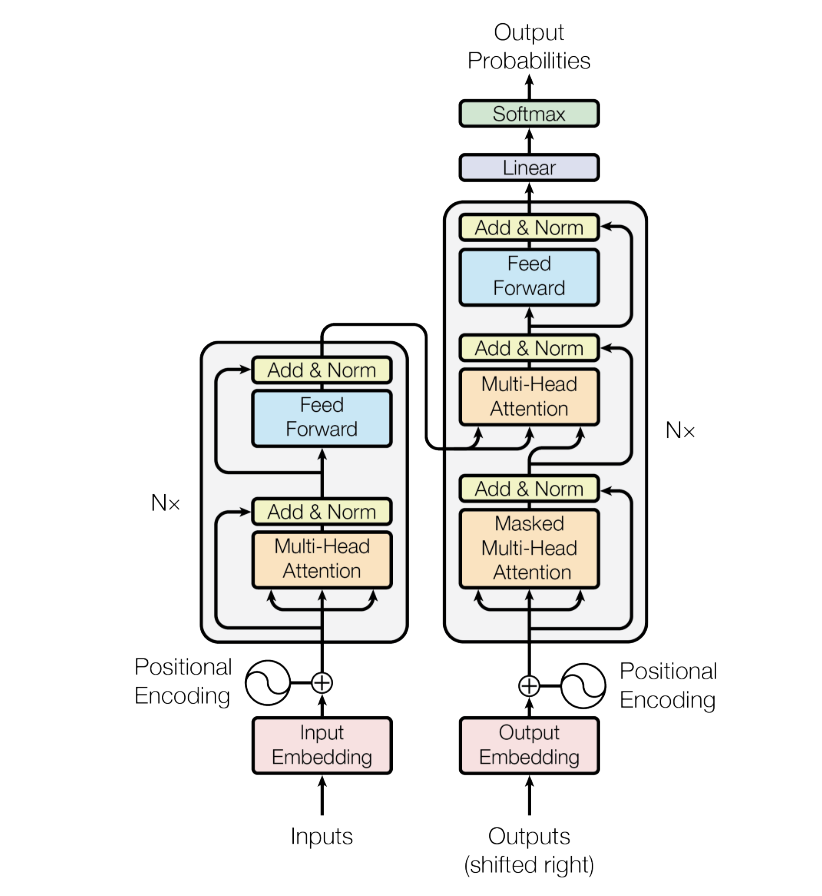
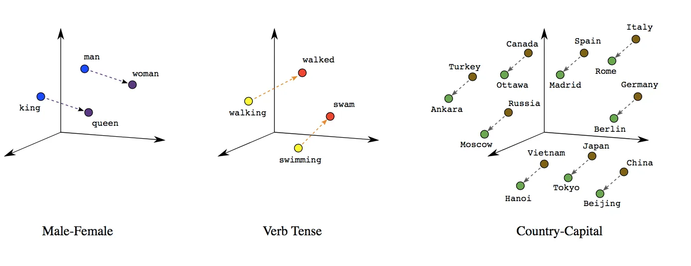
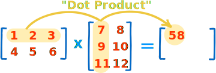

# Creating an LLM
---


---
# What is the plan?

   * Set the context
   * Check out a demo
   * Write some code
---
# Coding plan

  * Explore the input data
  * Prepare the input data
  * Build a simple model
  * Iterate and refine the model
  * Perform a full training run
---
# Attention Is All You Need

[gir.fyi/techx/attention](http://gir.fyi/techx/attention)

<!--
Chat GPT and other large language models are everywhere nowdays. Products are
adding generative features and companies, both big and small, are racing to
breaktrough in this emerging wave of artifical intelligence.

AI is not new. The ideas behind the technology have been around for decades.
However, now we are living in a time where the systems that we have available
and the data that feeds them are scalable enough to accomplish feats that
seemed impossible only a few years ago.

Much of modern generative LLM work can be traced back to this one paper.
-->
---


---
# nanoGPT

[gir.fyi/techx/nanoGPT](http://gir.fyi/techx/nanoGPT)
<!--
nanoGPT is a wonderful exploration into building a GPT model from scratch. We'll start with an empty notebook and quickly build and train a model to generate Shakespeare-like text.

This notebook is based off of a code and videos releasted by Andrej Karpathy. Please be sure to check out his work!

  * [Reference Video Lecture](https://www.youtube.com/watch?v=kCc8FmEb1nY)
  * [Reference Git Repository](https://github.com/karpathy/ng-video-lecture)
-->

---

# Keeping up

[gir.fyi/techx/llm](http://gir.fyi/techx/llm)

---
## Getting Started with Colab

[colab.research.google.com](http://colab.research.google.com)

---
## Getting Started with Colab
```python
print("hello world")
```
---
## Getting Started with Colab
```markdown
# LLM From Scratch 
```
---
## Getting Started with Colab

```markdown
File > Save a Copy in GitHub
```
---
# Exploratory Data Analysis

```shell
!wget http://gir.fyi/techx/input.txt
```
---
# Exploratory Data Analysis

```python
with open('input.txt', 'r', encoding='utf-8') as f:
    raw_training_data = f.read()

training_data_size = len(raw_training_data)
print(training_data_size)
```
---
# Exploratory Data Analysis

```python
import random

SAMPLE_SIZE = 500
start = random.randrange(0, training_data_size - SAMPLE_SIZE)
print(raw_training_data[start:start+SAMPLE_SIZE])
```
---
# Exploratory Data Analysis

```python
tokens = sorted(list(set(raw_training_data)))
token_count = len(tokens)

print(token_count)
print("".join(tokens))
```
---
# Data Preparation

```python
token_to_number = {t: i for i, t in enumerate(tokens)}
token_to_number
```
---
# Data Preparation

```python
number_to_token = {i: t for i, t in enumerate(tokens)}
number_to_token
```
---
# Data Preparation

```python
def encode(tokens: str) -> list[int]:
  return [token_to_number[t] for t in tokens]

encode('Google')
```
---
# Data Preparation

```python
def decode(numbers: list[int]) -> str:
  return ''.join(number_to_token[n] for n in numbers)

decode([32, 43, 41, 46, 36])
```
---
# Data Preparation

```python
encode(raw_training_data)
```
---

# PyTorch

[pytorch.org](https://pytorch.org/)

---
# Data Preparation

```python
import torch
data = torch.tensor(encode(raw_training_data), dtype=torch.long)
print(data.shape, data.dtype)
print(data[:100])
```

---

# What is a tensor?

---

[wikipedia definition](https://en.wikipedia.org/wiki/Tensor)

In mathematics, a tensor is an algebraic object that describes a multilinear relationship between sets of algebraic objects related to a vector space.

---
# Data Preparation

## Training/Validation Split

```python
training_data_size = int(0.9*len(raw_training_data))
training_data = raw_training_data[:training_data_size]
validation_data = raw_training_data[training_data_size:]
print(len(training_data), len(validation_data))
```
---
# Data Preparation

## Blocks

```python
BLOCK_SIZE = 8
training_data[:BLOCK_SIZE+1]
```
---
# Data Preparation

## Blocks

```python
start_from = random.randint(0, training_data_size-BLOCK_SIZE)
decode(training_data[start_from:start_from+BLOCK_SIZE].tolist())
```
---
# Data Preparation

## Blocks with Targets

```python
x = training_data[:BLOCK_SIZE]
y = training_data[1:BLOCK_SIZE+1]
for t in range(BLOCK_SIZE):
  context = x[:t+1]
  target = y[t]
  print(f"in: {context}, out: {target}")
```
---
# Data Preparation

## Batches
```python
torch.manual_seed(1337)

BATCH_SIZE = 4
BLOCK_SIZE = 8
```

---
# Data Preparation

## Batches

```python
def get_batch(split):
  data = training_data if split == 'train' else validation_data
  ix = torch.randint(len(data) - BLOCK_SIZE, (BATCH_SIZE,))
  x = torch.stack([data[i:i+BLOCK_SIZE] for i in ix])
  y = torch.stack([data[i+1:i+BLOCK_SIZE+1] for i in ix])
  return x,y
```
---

[torch.stack](https://pytorch.org/docs/stable/generated/torch.stack.html)

---
# Data Preparation

## Batches

```python
xb, yb = get_batch('train')
print('inputs')
print(xb.shape)
print(xb)
print('targets')
print(yb.shape)
print(yb)
```

---

# Data Preparation

## Batches

```python
for b in range(BATCH_SIZE):
  for t in range(BLOCK_SIZE):
    context = xb[b, :t+1]
    target = yb[b,t]
    print(f'input {context.tolist()}, target {target}')
```

---

# Let's Make a Model!

---

# First, some imports
```python
import torch
import torch.nn as nn
from torch.nn import functional as F
```

---

# And now, create a class

```python
class BigramLanguageModel(nn.Module):
    pass
```

---

# Bigram?

---

a pair of consecutive written units such as letters, syllables, or words.

----

# Add a constructor

```python
  def __init__(self, vocab_size):
    super().__init__()
    self.token_embedding_table = nn.Embedding(vocab_size, vocab_size)
```

---

# Embedding?

---



---

# Where were we?

# [gir.fyi/techx/llm](https://gir.fyi/techx/llm)

---

# Add the forward logic

Pull the embeddings for each of the batches.

```python
  def forward(self, token, targets):
    logits = self.token_embedding_table(token)
    B, T, C = logits.shape
    print(B, T, C)

m = BigramLanguageModel(vocab_size)
logits, loss = m(xb, yb)
```

Results in the following dimensions

```
4 8 65
```

---

# Reshape the embedded data so that we can calculate loss

```python
  def forward(self, token, targets):
    logits = self.token_embedding_table(token)
    B, T, C = logits.shape
    print(B, T, C)
    logits = logits.view(B*T, C)
    print(logits.shape)
```

```
4 8 65
torch.Size([32, 65])
```

---

# And now the targets

```python
  def forward(self, token, targets):
    logits = self.token_embedding_table(token)
    B, T, C = logits.shape
    logits = logits.view(B*T, C)
    print(targets.shape)
    targets = targets.view(B*T)
    print(targets.shape)
```

```
torch.Size([4, 8])
torch.Size([32])
```

---

# And finally, calculate loss

```python
  def forward(self, token, targets):
    logits = self.token_embedding_table(token)
    B, T, C = logits.shape
    logits = logits.view(B*T, C)
    targets = targets.view(B*T)
    loss = F.cross_entropy(logits, targets)

    return logits, loss

m = BigramLanguageModel(vocab_size)
_, loss = m(xb, yb)
loss
```

---

# There is a lot going on here!

---

# Logits?

---

[Google ML Glossary](https://developers.google.com/machine-learning/glossary/#logits)

The vector of raw predictions that a classification model generates

---

# Cross Entropy?

---

[Google ML Glossary](https://developers.google.com/machine-learning/glossary#cross-entropy)

A generalization of Log Loss to multi-class classification problems. Cross-entropy quantifies the difference between two probability distributions.

---

# Let's run this thing!

```python
torch.manual_seed(1337)
m = BigramLanguageModel(token_count)
logits, loss = m(xb, yb)
print(logits.shape)
print(loss)
```
---

# Is that number good?

---

```python
import numpy as np

print(-np.log(1/65.0))
```

---

# Time to generate some text!

---

# Create a generate function

```python
  def generate(self, idx, max_new_tokens):
    pass
```
---
# Call `forward`

```python
logits, loss = self(idx)
```

---

# Well, we have to handle `forward` with no targets

```python
  def forward(self, token, targets=None):
    logits = self.token_embedding_table(token)
    
    if targets is None:
      loss = None
    else:
      B, T, C = logits.shape
      logits = logits.view(B*T, C)
      targets = targets.view(B*T)
      loss = F.cross_entropy(logits, targets)

    return logits, loss
```

---

# Generate doesn't fail!

```python
m = BigramLanguageModel(vocab_size)
z = torch.zeros((1,1), dtype=torch.long)
generated = m.generate(z, max_new_tokens=100)
print(generated)
```

---

# What shape are the logits?

```python
  def generate(self, idx, max_new_tokens):
    logits, loss = self(idx)
    print(logits.shape)
```

---

# Reshape it a bit

```python
  def generate(self, idx, max_new_tokens):
    logits, loss = self(idx)
    print(logits.shape)
    logits = logits[:, -1, :] # (B, C)
    print(logits.shape)
```

---

# Apply a softmax

```python
  def generate(self, idx, max_new_tokens):
    logits, loss = self(idx)
    print(logits.shape)
    logits = logits[:, -1, :] # (B, C)
    print(logits.shape)
    print(logits)
    probs = F.softmax(logits, dim=-1) # (B, C)
    print(probs)
    print(sum(probs[0]))
```

---

# Softmax?
---
[Google ML Glossary](https://developers.google.com/machine-learning/glossary#softmax)

A function that determines probabilities for each possible class in a multi-class classification model. The probabilities add up to exactly 1.0.

---

# Predict the next character

```python
  def generate(self, idx, max_new_tokens):
    logits, loss = self(idx)
    logits = logits[:, -1, :] # (B, C)
    probs = F.softmax(logits, dim=-1) # (B, C)
    idx_next = torch.multinomial(probs, num_samples=1) # (B, 1)
    print(idx_next)
```

---

# And add it to the tensor

```python
  def generate(self, idx, max_new_tokens):
    for _ in range(max_new_tokens):
      logits, loss = self(idx)
      logits = logits[:, -1, :] # (B, C)
      probs = F.softmax(logits, dim=-1) # (B, C)
      idx_next = torch.multinomial(probs, num_samples=1) # (B, 1)
      idx = torch.cat((idx, idx_next), dim=1)
    return idx
```
---

# Let's see what we get!

---

# First, choose a starting token

```python
z = torch.zeros((1,1), dtype=torch.long)
print(z)
```

---

# Now generate some new tokens

```python
generated = m.generate(z, max_new_tokens=100)
print(generated)
```

---

# Let's see that in text form

```python
generated_list = generated[0].tolist()
print(decode(generated_list))
```

---

# I think we can do better :)

---

# So far we haven't actually trained the model

---

# Training the model

---

# First, let's create an optimizer

```
optimizer = torch.optim.Adam(m.parameters(), lr=1e-3)
```

---

# Optimizer?

---

[Google ML Glossary](https://developers.google.com/machine-learning/glossary#gradient-descent)

A mathematical technique to minimize loss. Gradient descent iteratively adjusts weights and biases, gradually finding the best combination to minimize loss.

---

# Let's create a training loop

```python
BATCH_SIZE = 32

for steps in range(10000):
  xb, yb = get_batch('train')

  logits, loss = m(xb, yb)
  optimizer.zero_grad(set_to_none=True)
  loss.backward()
  optimizer.step()

print(loss.item())
```

---

# And now generate some data

```python
z = torch.zeros((1,1), dtype=torch.long)
generated = m.generate(z, max_new_tokens=100)
generated_list = generated[0].tolist()
print(decode(generated_list))
```

---

# Looking better!

---

# Double-check our list of parameters

```python
BATCH_SIZE = 32
BLOCK_SIZE = 8
LEARNING_RATE = 1e-3
MAX_ITERS = 5000
EVAL_INTERVAL = 300
EVAL_ITERS = 200
```
---

# And write a function for calculating loss

```python
@torch.no_grad()
def estimate_loss():
  out = {}
  m.eval()
  for split in ['train', 'val']:
    losses = torch.zeros(EVAL_ITERS)
    for k in range(EVAL_ITERS):
      X, Y = get_batch(split)
      logits, loss = m(X, Y)
      losses[k] = loss.item()
    out[split] = losses.mean()
  m.train()
  return out
```
---

# Update our training loop

```python
for iter in range(MAX_ITERS):

  if iter % EVAL_INTERVAL == 0:
    losses = estimate_loss()
    print(f"iter {iter}; train loss {losses['train']:.4f}; val loss {losses['val']:.4f}")
    
  xb, yb = get_batch('train')

  logits, loss = m(xb, yb)
  optimizer.zero_grad(set_to_none=True)
  loss.backward()
  optimizer.step()
```

---

# And do a generation

```python
context = torch.zeros((1,1), dtype=torch.long, device=device)
print(decode(m.generate(context, max_new_tokens=500)[0].tolist()))
```

---

# We've created and trained a model

---

# But it is kind of dumb

---

# So first let's fix some things based on the paper and other feedback

---

# First, we'll lower the size of the embedding

```python
NUM_EMBEDDINGS = 32
```

Constructor changes

```python
    self.token_embedding_table = nn.Embedding(vocab_size, NUM_EMBEDDINGS)
```

Forward changes
```python
    embedded_values = self.token_embedding_table(token)
    logits = self.lm_head(embedded_values)
```

---

# Wow, much better!

---

# Now let's look into self-attention

---

# First, we can think about position

Constructor

```python
self.position_embedding_table = nn.Embedding(block_size, n_embed)
```

Forward
```python
  def forward(self, token, targets=None):
    token_embeddings = self.token_embedding_table(token)
    B, T = token.shape
    position_embeddings = self.position_embedding_table(torch.arange(T))
    x = token_embeddings + position_embeddings

    logits = self.lm_head(x)
```

Generate
```python
      idx_cond = idx[:, -BLOCK_SIZE:]
      logits, loss = self(idx_cond)
```

---

# First, create a randomly populated tensor

```python
torch.manual_seed(1337)
B,T,C = 4,8,2
x = torch.randn(B,T,C)
x
```

---

# And then do some averaging

```python
xbow = torch.zeros((B,T,C))
for b in range(B):
  for t in range(T):
    xprev = x[b,:t+1]
    xbow[b,t] = torch.mean(xprev, 0)

x[0], xbow[0]
```

---

# Check the math

```
(-0.07+-0.9152+0.0255)/3
```

---

# Let's do something similar using matrix math

```python
torch.manual_seed(42)
a = torch.ones(3,3)
b = torch.randint(0, 10, (3,2)).float()
c = a @ b
```

---

# @ is matrix multiplication

---



---

# Make sure the numbers work

```python
print('a=')
print(a)
print('----------------')
print('b=')
print(b)
print('----------------')
print('c=')
print(c)
print('----------------')
```

---

# Now we can start to get fancy with math

---

# Tril

```python
torch.tril(torch.ones(3,3))
```

---

# Tril applied

```python
torch.manual_seed(42)
a = torch.tril(torch.ones(3,3))
b = torch.randint(0, 10, (3,2)).float()
c = a @ b
```

---

# Let's print it out

```python
print('a=')
print(a)
print('----------------')
print('b=')
print(b)
print('----------------')
print('c=')
print(c)
print('----------------')
```

---

# And now with an even split on impact

```python
torch.manual_seed(42)
a = torch.tril(torch.ones(3,3))
a = a / torch.sum(a, 1, keepdim=True)
b = torch.randint(0, 10, (3,2)).float()
c = a @ b
```

---

# Print that out

```python
print('a=')
print(a)
print('----------------')
print('b=')
print(b)
print('----------------')
print('c=')
print(c)
print('----------------')
```

---

# Let's integrate this with our model

---

# Look at the nice even distrubution

```python
weights = torch.tril(torch.ones(T, T))
weights = weights / weights.sum(1, keepdim=True)
weights
```

---

# Mathy math math math

```python
weights = torch.tril(torch.ones(T, T))
weights = weights / weights.sum(1, keepdim=True)
xbow2 = weights @ x # (B, T, T) @ (B, T, C)
torch.allclose(xbow, xbow2)
```

---

# What?

```python
weights = torch.tril(torch.ones(T, T))
weights = weights / weights.sum(1, keepdim=True)
xbow2 = weights @ x # (B, T, T) @ (B, T, C)
print(torch.allclose(xbow[0], xbow2[0]))
print(torch.allclose(xbow[1], xbow2[1]))
print(torch.allclose(xbow[2], xbow2[2]))
print(torch.allclose(xbow[3], xbow2[3]))
```

---

# What what?

```python
#torch.allclose(xbow[1][5], xbow2[1][5])
xbow[1][5], xbow2[1][5]
```

---

# And a little more math

```python
tril = torch.tril(torch.ones(T, T))
weights = torch.zeros((T,T))
weights = weights.masked_fill(tril == 0, float('-inf'))
weights = F.softmax(weights, dim=-1)
xbow3 = weights @ x
torch.allclose(xbow2, xbow3)
```

---

# And even more

```python
torch.manual_seed(1337)
B,T,C = 4,8,32
x = torch.randn(B,T,C)

head_size = 16
key = nn.Linear(C, head_size, bias=False)
query = nn.Linear(C, head_size, bias=False)

k = key(x) # (B, T, 16)
q = query(x) # (B, T, 16)

wei = q @ k.transpose(-2, -1) # (B, T, 16) @ (B, 16, T) -> (B, T, T)

tril = torch.tril(torch.ones(T,T))
#wei = torch.zeros(T,T)
wei = wei.masked_fill(tril == 0, float('-inf'))
wei = F.softmax(wei, dim=-1)
out = wei @ x

out.shape
```

---

# And finally

```python
torch.manual_seed(1337)
B,T,C = 4,8,32
x = torch.randn(B,T,C)

head_size = 16
key = nn.Linear(C, head_size, bias=False)
query = nn.Linear(C, head_size, bias=False)
value = nn.Linear(C, head_size, bias=False)

k = key(x) # (B, T, 16)
q = query(x) # (B, T, 16)

wei = q @ k.transpose(-2, -1) # (B, T, 16) @ (B, 16, T) -> (B, T, T)

tril = torch.tril(torch.ones(T,T))
# wei = torch.zeros(T,T)
wei = wei.masked_fill(tril == 0, float('-inf'))
wei = F.softmax(wei, dim=-1)

v = value(x)
out = wei @ v

out.shape
```

---

# Okay, let's make that into something

---

```python
class Head(nn.Module):
```

---

# Add a constructor

```python
    def __init__(self, head_size):
        super().__init__()
        self.key = nn.Linear(NUM_EMBEDDINGS, head_size, bias=False)
        self.query = nn.Linear(NUM_EMBEDDINGS, head_size, bias=False)
        self.value = nn.Linear(NUM_EMBEDDINGS, head_size, bias=False)
        self.register_buffer('tril', torch.tril(torch.ones(BLOCK_SIZE, BLOCK_SIZE)))
```

---

# Add a forward

```python
    def forward(self, x):
        B,T,C = x.shape
        k = self.key(x)
        q = self.query(x)
        wei = q @ k.transpose(-2, -1) * C**-0.5
        wei = wei.masked_fill(self.tril[:T, :T] == 0, float('-inf'))
        wei = F.softmax(wei, dim=-1)
        v = self.value(x)
        out = wei @ v
        return out
```

---

# Update the constructor

```python
  def __init__(self, vocab_size):
    super().__init__()
    self.token_embedding_table = nn.Embedding(vocab_size, NUM_EMBEDDINGS)
    self.position_embedding_table = nn.Embedding(BLOCK_SIZE, NUM_EMBEDDINGS)
    self.sa_head = Head(NUM_EMBEDDINGS)
    self.lm_head = nn.Linear(NUM_EMBEDDINGS, vocab_size)
```

---

# And the forward

```
    token_embeddings = self.token_embedding_table(token)
    B, T = token.shape
    position_embeddings = self.position_embedding_table(torch.arange(T))
    x = token_embeddings + position_embeddings
    x = self.sa_head(x)
    logits = self.lm_head(x)
```

---

# But the paper mentions multi-head?

---

# Create a class to define multiple heads

```python
class MultiHeadAttention(nn.Module):
    def __init__(self, num_heads, head_size):
        super().__init__()
        self.heads = nn.ModuleList([Head(head_size) for _ in range(num_heads)])

    def forward(self, x):
        return torch.cat([h(x) for h in self.heads], dim=-1)
```

---

# Add it to the constructor

```python
  def __init__(self, vocab_size):
    super().__init__()
    self.token_embedding_table = nn.Embedding(vocab_size, NUM_EMBEDDINGS)
    self.position_embedding_table = nn.Embedding(BLOCK_SIZE, NUM_EMBEDDINGS)
    self.sa_heads = MultiHeadAttention(4, NUM_EMBEDDINGS//4)
    self.lm_head = nn.Linear(NUM_EMBEDDINGS, vocab_size)
```

---

# And call the new layer

```python
    x = token_embeddings + position_embeddings
    x = self.sa_heads(x)
    logits = self.lm_head(x)
```

---

# Next we add a feed-forward layer

---

# Class

```python
class FeedForward(nn.Module):
    def __init__(self, n_embed):
        super().__init__()
        self.net = nn.Sequential(
            nn.Linear(n_embed, n_embed),
            nn.ReLU(),
        )

    def forward(self, x):
        return self.net(x)
```

---

# Constructor

```python
    self.feed_forward = FeedForward(NUM_EMBEDDINGS)
```

---

# Forward

```python
    x = self.sa_heads(x)
    x = self.feed_forward(x)
    logits = self.lm_head(x)
```

---

# We have a single line of logic, but let's create a block to repeat it

---

```python
class Block(nn.Module):
    def __init__(self, n_embed, n_head):
        super().__init__()
        head_size = n_embed // n_head
        self.sa = MultiHeadAttention(n_head, head_size)
        self.ffwd = FeedForward(n_embed)

    def forward(self, x):
        x = self.sa(x)
        x = self.ffwd(x)
        return x
```

---

# Now create blocks

```python
    self.blocks = nn.Sequential(
      Block(NUM_EMBEDDINGS, n_head=4),
      Block(NUM_EMBEDDINGS, n_head=4),
      Block(NUM_EMBEDDINGS, n_head=4),
    )
```

---

# And then use them

```python
    x = token_embeddings + position_embeddings
    x = self.blocks(x)
    logits = self.lm_head(x)
```

---

# Continuing to improve... let's add projection

---

# Projections is just a linear layer to multi-head

```python
self.proj = nn.Linear(NUM_EMBEDDINGS, NUM_EMBEDDINGS)
```

---

# And change up multi-head attention

```python
class MultiHeadAttention(nn.Module):
  def __init__(self, num_heads, head_size):
    super().__init__()
    self.heads = nn.ModuleList([Head(head_size) for _ in range(num_heads)])

  def forward(self, x):
    out = torch.cat([h(x) for h in self.heads], dim=-1)
    out = self.proj(out)
    return out
```

---

# And change feedforward

```python
class FeedForward(nn.Module):
  def __init__(self, n_embed):
    super().__init__()
    self.net = nn.Sequential(
        nn.Linear(n_embed, 4*n_embed),
        nn.ReLU(),
        nn.Linear(4*n_embed, n_embed),
    )
```

---

# And then block foward

```python
  def forward(self, x):
    x = x + self.sa(x)
    x = x + self.ffwd(x)
    return x
```

---

# We can do some norming in the block

```python
class Block(nn.Module):
  def __init__(self, n_embed, n_head):
    super().__init__()
    head_size = n_embed // n_head
    self.sa = MultiHeadAttention(n_head, head_size)
    self.ffwd = FeedForward(n_embed)
    self.ln1 = nn.LayerNorm(n_embed)
    self.ln2 = nn.LayerNorm(n_embed)

  def forward(self, x):
    x = x + self.sa(self.ln1(x))
    x = x + self.ffwd(self.ln2(x))
    return x
```

---

# And in our sequential

```python
    self.blocks = nn.Sequential(
      Block(NUM_EMBEDDINGS, n_head=4),
      Block(NUM_EMBEDDINGS, n_head=4),
      Block(NUM_EMBEDDINGS, n_head=4),
      nn.LayerNorm(NUM_EMBEDDINGS),
    )
```

---

# Time to turn it up to 11

---

# First, let's crank up the constants

```python
BATCH_SIZE = 64
BLOCK_SIZE = 256
LEARNING_RATE = 3e-4
MAX_ITERS = 3000
EVAL_INTERVAL = 500
EVAL_ITERS = 200
NUM_EMBEDDINGS = 384
NUM_HEADS = 6
NUM_LAYERS = 6
DROPOUT = 0.2
```

---

# Add dropouts to head and multi-head and sequential

```python
self.dropout = nn.Dropout(DROPOUT)
```

---

# Head

```python
    def forward(self, x):
        B,T,C = x.shape
        k = self.key(x)
        q = self.query(x)
        wei = q @ k.transpose(-2, -1) * C**-0.5
        wei = wei.masked_fill(self.tril[:T, :T] == 0, float('-inf'))
        wei = F.softmax(wei, dim=-1)
        wei = self.dropout(wei)
        v = self.value(x)
        out = wei @ v
        return out
```

---

# Multihead

```python
    def forward(self, x):
      out = torch.cat([h(x) for h in self.heads], dim=-1)
      out = self.dropout(self.proj(out))
      return out
```

---

# Sequential

```python
        nn.Dropout(dropout)
```

---

# And make blocks variable

```python
class BigramLanguageModel(nn.Module):

  def __init__(self, vocab_size):
    super().__init__()
    self.token_embedding_table = nn.Embedding(vocab_size, NUM_EMBEDDINGS)
    self.position_embedding_table = nn.Embedding(BLOCK_SIZE, NUM_EMBEDDINGS)
    self.blocks = nn.Sequential(*[Block(NUM_EMBEDDINGS, n_head=NUM_HEADS) for _ in range(NUM_LAYERS)])
    self.ln_f = nn.LayerNorm(NUM_EMBEDDINGS)
    self.lm_head = nn.Linear(NUM_EMBEDDINGS, vocab_size)
```

---

# Forward

```python
  def forward(self, token, targets=None):
    token_embeddings = self.token_embedding_table(token)
    B, T = token.shape
    position_embeddings = self.position_embedding_table(torch.arange(T))
    x = token_embeddings + position_embeddings
    x = self.blocks(x)
    x = self.ln_f(x)
    logits = self.lm_head(x)
```
---

# Run for a few hours and then... Shakespeare?

---

